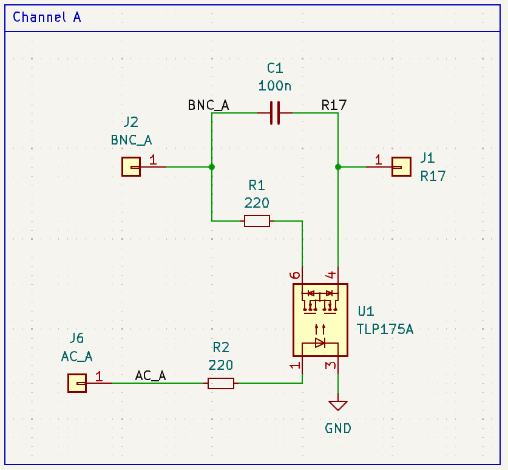
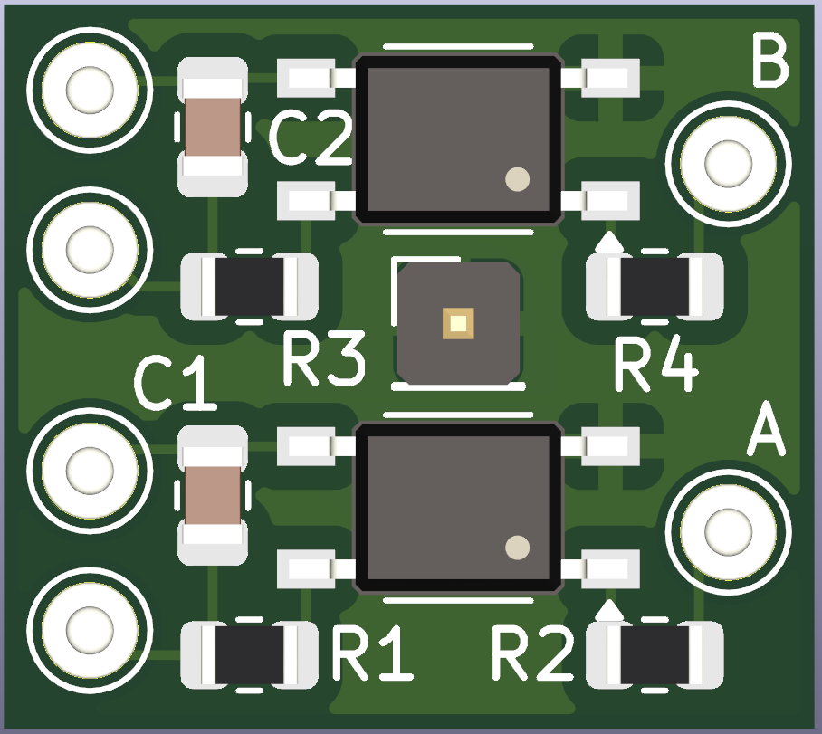
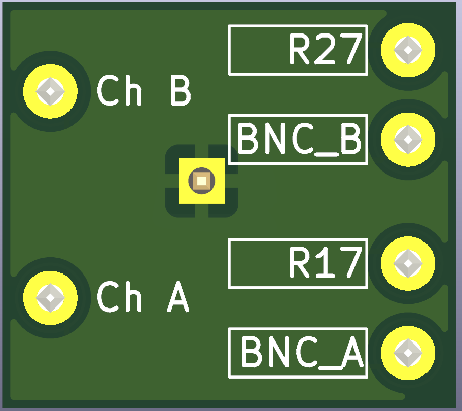
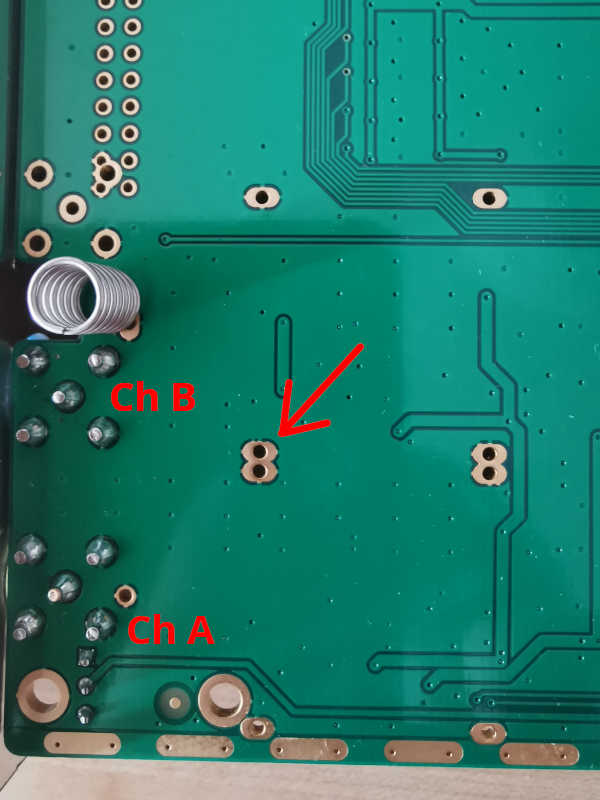

# Hantek 6022BE AC mod

Simple pcb to add AC coupling to the Hantek 6022BE oscilloscope. Based on the widespread mod available here: https://github.com/OpenHantek/OpenHantek6022/blob/main/docs/HANTEK6022_AC_Modification.pdf

Compatible with the [OpenHantek6022 project](https://github.com/OpenHantek/OpenHantek6022)

## Circuit

When `AC_A` is high `C1` is short so the signal is DC coupled. When `AC_A` is low `C1` is open so the signal is AC coupled.

## PCB

Back layer can be avoided especially in case of pcb milling.

  
  

## BOM
Reference | Value | Datasheet | Footprint | Qty
--- | --- | --- | --- | ---
C1,C2 | 100n | ~ | Capacitor_SMD:C_0805_2012Metric | 2
R1,R2,R3,R4 | 220 | ~ | Resistor_SMD:R_0805_2012Metric | 4
U1,U2 | TLP175A | [Datasheet](https://toshiba.semicon-storage.com/info/docget.jsp?did=13665&prodName=TLP175A) | Package_SO:MFSOP6-4_4.4x3.6mm_P1.27mm | 2

## Mounting

The pcb can be mounted on an unpopulated shield hole

  

